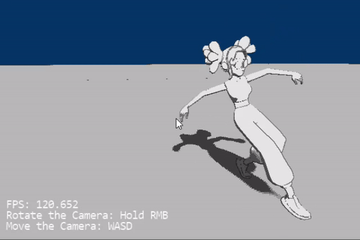

# DirectX 12 Renderer

This is a generic 3D renderer for Windows, built using C++ and DirectX 12.

Here are the main characteristics of the project:
- The renderer follows the standart Deferred Rendering pipelines.
- For the actual rendering, I have implemented a simple cel shading, based on the Blinn-Phong lighting model.
- Shadows are also supported and implemented by the method of cascaded shadow maps.
- Custom geometry for rendering can be loaded from COLLADA (.dae) files.
- Both static and skeletal meshes are supported for rendering. Playing animations on the skeletal ones, is also available.
- There is also a minimal functionality for rendering text on the screen, which is currently used only for displaying debug messages.

The next thing, I want to add to the project, is some sort of scripting system to facilitate implementing runtime logic... 

Here is a render of some cartoon house:

And a render of some dance animation:

